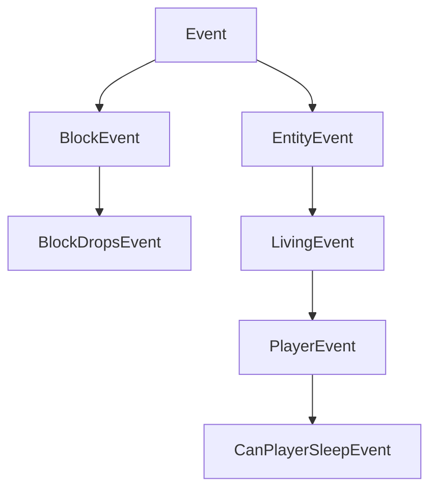

import Tabs from '@theme/Tabs';
import TabItem from '@theme/TabItem';

# **事件**(`Events`)

**NeoForge**(`NeoForge`)的核心功能之一是其事件系统。当游戏中发生各种事件时会触发对应的事件。例如：玩家右键点击时、玩家或其他实体跳跃时、方块渲染时、游戏加载时等事件。模组开发者可以向这些事件注册**事件处理器**(`event handlers`)，并在处理器内部执行所需行为。

事件在各自的事件总线上触发。最重要的总线是 `NeoForge.EVENT_BUS`（也称为**游戏总线**(`game bus`)）。此外，在启动期间，系统会为每个加载的模组生成一个**模组总线**(`mod bus`)并传入模组的构造函数中。许多模组总线事件是并行触发的（与始终在同一线程运行的主总线事件相反），这显著提高了启动速度。更多信息请参阅[下文][modbus]。

## 注册事件处理器

注册事件处理器有多种方式。所有方式的共同点是：每个事件处理器都是一个仅接收单个事件参数且无返回值（即返回类型为 `void`）的方法。

### `IEventBus#addListener`

最简单的注册方式是通过方法引用注册，如下所示：

```java
@Mod("yourmodid")
public class YourMod {
    public YourMod(IEventBus modBus) {
        NeoForge.EVENT_BUS.addListener(YourMod::onLivingJump);
    }

    // 每次实体跳跃时治疗半颗心
    private static void onLivingJump(LivingEvent.LivingJumpEvent event) {
        LivingEntity entity = event.getEntity();
        // 仅在服务端治疗
        if (!entity.level().isClientSide()) {
            entity.heal(1);
        }
    }
}
```

### `@SubscribeEvent`

或者，可以通过创建事件处理器方法并用 `@SubscribeEvent` 注解来驱动事件处理。然后，将包含该方法的类实例传递给事件总线，以注册该实例中所有被 `@SubscribeEvent` 注解的事件处理器：

```java
public class EventHandler {
    @SubscribeEvent
    public void onLivingJump(LivingEvent.LivingJumpEvent event) {
        LivingEntity entity = event.getEntity();
        if (!entity.level().isClientSide()) {
            entity.heal(1);
        }
    }
}

@Mod("yourmodid")
public class YourMod {
    public YourMod(IEventBus modBus) {
        NeoForge.EVENT_BUS.register(new EventHandler());
    }
}
```

也可以静态注册。只需将所有事件处理器设为静态，然后直接传递类本身（而非类实例）：

```java
public class EventHandler {
	@SubscribeEvent
    public static void onLivingJump(LivingEvent.LivingJumpEvent event) {
        LivingEntity entity = event.getEntity();
        if (!entity.level().isClientSide()) {
            entity.heal(1);
        }
    }
}

@Mod("yourmodid")
public class YourMod {
    public YourMod(IEventBus modBus) {
        NeoForge.EVENT_BUS.register(EventHandler.class);
    }
}
```

### `@EventBusSubscriber`

更进一步，还可以用 `@EventBusSubscriber` 注解事件处理器类。NeoForge 会自动发现此注解，从而允许您从模组构造函数中移除所有与事件相关的代码。本质上，它等效于在模组构造函数末尾调用 `NeoForge.EVENT_BUS.register(EventHandler.class)` 和 `modBus.register(EventHandler.class)`。这也意味着所有处理器必须是静态的。

虽然非必需，但强烈建议在注解中指定 `modid` 参数，以便于调试（尤其在处理模组冲突时）。

```java
@EventBusSubscriber(modid = "yourmodid")
public class EventHandler {
    @SubscribeEvent
    public static void onLivingJump(LivingEvent.LivingJumpEvent event) {
        LivingEntity entity = event.getEntity();
        if (!entity.level().isClientSide()) {
            entity.heal(1);
        }
    }
}
```

## 事件选项

### 字段与方法

字段和方法可能是事件中最直观的部分。大多数事件包含供事件处理器使用的上下文，例如触发事件的实体或事件发生的维度。

### 继承层次结构

为利用继承优势，某些事件不直接扩展 `Event`，而是扩展其子类之一，例如 `BlockEvent`（包含方块相关事件的方块上下文）或 `EntityEvent`（类似地包含实体上下文）及其子类 `LivingEvent`（用于 `LivingEntity` 特定上下文）和 `PlayerEvent`（用于 `Player` 特定上下文）。这些提供上下文的父事件是 `abstract` 的，无法被监听。

:::danger
若监听 `abstract` 事件，游戏将崩溃，因为这绝非预期行为。您应始终监听其子事件。
:::



### 可取消事件

某些事件实现了 `ICancellableEvent` 接口。这些事件可通过 `#setCanceled(boolean canceled)` 取消，并通过 `#isCanceled()` 检查取消状态。若事件被取消，该事件的其他处理器将不会运行，且会启用与"取消"相关的特定行为。例如，取消 `LivingChangeTargetEvent` 将阻止实体更改目标实体。

事件处理器可选择显式接收已取消的事件。这通过在 `IEventBus#addListener`（或 `@SubscribeEvent`，取决于事件处理器的附加方式）中将 `receiveCanceled` 布尔参数设为 true 来实现。

### 三态与结果

某些事件具有三种可能的返回状态，由 `TriState` 或事件类上的 `Result` 枚举表示。返回状态通常可取消事件处理的操作（`TriState#FALSE`）、强制操作运行（`TriState#TRUE`）或执行默认原版行为（`TriState#DEFAULT`）。

具有三种返回状态的事件会提供 `set*` 方法来设置期望结果。

```java
// 在某个事件处理器类中

@SubscribeEvent // 在游戏事件总线上
public static void renderNameTag(RenderNameTagEvent.CanRender event) {
    // 使用 TriState 设置返回状态
    event.setCanRender(TriState.FALSE);
}

@SubscribeEvent // 在游戏事件总线上
public static void mobDespawn(MobDespawnEvent event) {
    // 使用 Result 枚举设置返回状态
    event.setResult(MobDespawnEvent.Result.DENY);
}
```

### 优先级

事件处理器可被分配优先级。`EventPriority` 枚举包含五个值：`HIGHEST`、`HIGH`、`NORMAL`（默认）、`LOW` 和 `LOWEST`。事件处理器按优先级从高到低执行。若优先级相同，在主总线上按注册顺序（大致与模组加载顺序相关）触发，在模组总线上则严格按模组加载顺序触发（见下文）。

优先级可通过在 `IEventBus#addListener` 或 `@SubscribeEvent` 中设置 `priority` 参数定义（取决于事件处理器的附加方式）。注意：并行触发的事件会忽略优先级。

### 端特定事件

某些事件仅在单一[端](`side`)[side]触发。常见示例包括各种渲染事件，它们仅在客户端触发。由于仅客户端事件通常需要访问 Minecraft 代码库中其他仅客户端部分，因此需要相应注册。

使用 `IEventBus#addListener()` 的事件处理器应通过 `FMLEnvironment.dist` 或模组构造函数中的 `Dist` 参数检查当前物理端，并在单独的仅客户端类中添加监听器，如[端](`sides`)[side]一文中所述。

使用 `@EventBusSubscriber` 的事件处理器可将端指定为注解的 `value` 参数，例如 `@EventBusSubscriber(value = Dist.CLIENT, modid = "yourmodid")`。

## 事件总线

虽然大多数事件在 `NeoForge.EVENT_BUS` 上发布，但部分事件在模组事件总线上发布。这些通常称为**模组总线事件**(`mod bus events`)。模组总线事件可通过其父接口 `IModBusEvent` 与常规事件区分。

模组事件总线作为参数传入模组构造函数，您可向其订阅模组总线事件。若使用 `@EventBusSubscriber`，事件会自动订阅到正确的总线。

### 模组生命周期

大多数模组总线事件是**生命周期事件**(`lifecycle events`)。生命周期事件在启动期间每个模组的生命周期中运行一次。其中许多事件通过继承 `ParallelDispatchEvent` 并行触发；若需在主线程运行这些事件中的代码，请使用 `#enqueueWork(Runnable runnable)` 将其加入队列。

生命周期通常遵循以下顺序：

- 调用模组构造函数。在此处或下一步注册事件处理器。
- 调用所有 `@EventBusSubscriber`。
- 触发 `FMLConstructModEvent`。
- 触发注册表事件，包括 [`NewRegistryEvent`][newregistry]、[`DataPackRegistryEvent.NewRegistry`][newdatapackregistry] 及每个注册表的 [`RegisterEvent`][registerevent]。
- 触发 `FMLCommonSetupEvent`。此处进行各种杂项设置。
- 触发[端](`side`)[side]特定设置：物理客户端触发 `FMLClientSetupEvent`，物理服务端触发 `FMLDedicatedServerSetupEvent`。
- 处理 `InterModComms`（见下文）。
- 触发 `FMLLoadCompleteEvent`。

#### `InterModComms`

`InterModComms` 是允许模组开发者向其他模组发送消息以实现兼容性功能的系统。该类持有模组的消息，所有方法均为线程安全调用。该系统主要由两个事件驱动：`InterModEnqueueEvent` 和 `InterModProcessEvent`。

在 `InterModEnqueueEvent` 期间，可使用 `InterModComms#sendTo` 向其他模组发送消息。这些方法接受目标模组 ID、与消息数据关联的键（用于区分不同消息）以及持有消息数据的 `Supplier`。发送方也可选择性指定。

接着，在 `InterModProcessEvent` 期间，可使用 `InterModComms#getMessages` 获取所有接收消息的流（作为 `IMCMessage` 对象）。这些对象包含数据发送方、预期接收方、数据键以及实际数据的供应器。

### 其他模组总线事件

除生命周期事件外，还有一些杂项事件在模组事件总线上触发（主要因历史原因）。这些通常是用于注册、设置或初始化各类内容的事件。与生命周期事件不同，大多数此类事件非并行运行。例如：

- `RegisterColorHandlersEvent.Block`, `.ItemTintSources`, `.ColorResolvers` 
- `ModelEvent.BakingCompleted`
- `TextureAtlasStitchedEvent`

:::warning
这些事件大多计划在未来版本移至游戏事件总线。
:::

[modbus]: #事件总线
[newdatapackregistry]: registries.md#自定义数据包注册表
[newregistry]: registries.md#自定义注册表
[registerevent]: registries.md#注册事件
[side]: sides.md