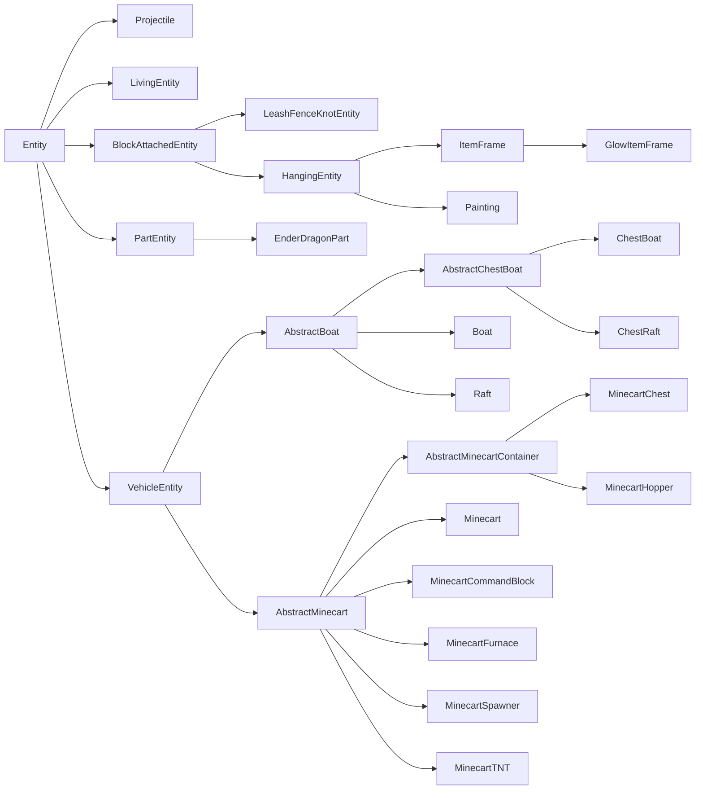
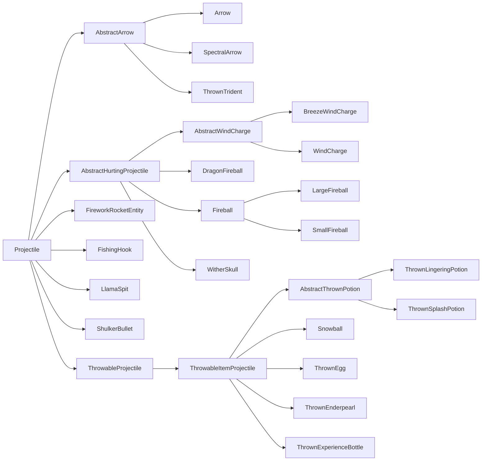

---
sidebar_position: 1
---
# **实体**(`Entities`)

**实体**(`Entities`)是游戏世界中可以以多种方式与世界互动的对象。常见的例子包括**生物**(`mobs`)、**抛射物**(`projectiles`)、**可骑乘对象**(`rideable objects`)，甚至**玩家**(`players`)。每个实体由多个系统组成，这些系统乍一看可能并不容易理解。本节将分解与构建实体并使其按照模组开发者意图行为相关的一些关键组件。

## **术语**(`Terminology`)

一个简单的实体由三部分组成：

- [`Entity`][entity] 子类，它包含我们实体的大部分逻辑
- [`EntityType`][type]，它被[注册][registration]并保存一些通用属性，以及
- [`EntityRenderer`][renderer]，它负责在游戏中显示实体

更复杂的实体可能需要更多部分。例如，许多更复杂的 `EntityRenderer` 使用底层的 `EntityModel` 实例。或者，自然生成的实体需要某种[生成机制][spawning]。

## `EntityType`

`EntityType` 和 `Entity` 之间的关系类似于 [`Item`][item] 和 [`ItemStack`][itemstack] 之间的关系。与 `Item` 类似，`EntityType` 是注册到相应注册表（实体类型注册表）的**单例**(`singletons`)，并保存该类型所有实体共有的一些值；而 `Entity`，类似于 `ItemStack`，是该单例类型的“实例”，保存特定于该实体实例的数据。然而，这里的关键区别在于，大部分行为不是在单例 `EntityType` 中定义，而是在实例化的 `Entity` 类本身中定义。

让我们创建我们的 `EntityType` 注册表并为其注册一个 `EntityType`，假设我们有一个扩展自 `Entity` 的类 `MyEntity`（更多信息请参见[下文][entity]）。`EntityType.Builder` 上的所有方法，除了最后的 `#build` 调用，都是可选的。

```java
public static final DeferredRegister.Entities ENTITY_TYPES =
    DeferredRegister.createEntities(ExampleMod.MOD_ID);

public static final Supplier<EntityType<MyEntity>> MY_ENTITY = ENTITY_TYPES.register(
    "my_entity",
    // 实体类型，使用构建器创建。
    () -> EntityType.Builder.of(
        // 一个 EntityType.EntityFactory<T>，其中 T 是使用的实体类 - 在此为 MyEntity。
        // 你可以将其视为 BiFunction<EntityType<T>, Level, T>。
        // 这通常是实体构造函数的引用。
        MyEntity::new,
        // 我们的实体使用的 MobCategory。这主要与生成相关。
        // 更多信息见下文。
        MobCategory.MISC
    )
    // 宽度和高度，以方块为单位。宽度在水平两个方向上都使用。
    // 这也意味着不支持非正方形的足迹。默认为 0.6f 和 1.8f。
    .sized(1.0f, 1.0f)
    // 一个乘数因子（标量），用于生成不同大小的生物。
    // 在原生版本中，只有史莱姆和岩浆怪使用，两者都使用 4.0f。
    .spawnDimensionsScale(4.0f)
    // 眼睛高度，从尺寸底部起算的方块数。默认为高度 * 0.85。
    // 必须在 #sized 之后调用才有效。
    .eyeHeight(0.5f)
    // 禁止通过 /summon 召唤实体。
    .noSummon()
    // 防止实体被保存到磁盘。
    .noSave()
    // 使实体防火。
    .fireImmune()
    // 使实体对来自特定方块的伤害免疫。原生版本用此使
    // 狐狸对甜浆果丛免疫，凋灵和凋灵骷髅对凋零玫瑰免疫，
    // 以及北极熊、雪傀儡和流浪者对细雪免疫。
    .immuneTo(Blocks.POWDER_SNOW)
    // 禁用在生成处理程序中限制实体生成距离的规则。
    // 这意味着无论距离玩家多远，此实体都可以生成。
    // 原生版本为掠夺者和潜影贝启用此功能。
    .canSpawnFarFromPlayer()
    // 客户端保持实体加载的范围，以区块为单位。
    // 原生版本的值各不相同，但通常是 8 或 10 左右。默认为 5。
    // 请注意，如果此值大于客户端的区块视距，
    // 那么将有效地使用客户端的区块视距。
    .clientTrackingRange(8)
    // 为此实体发送更新数据包的频率，每 x 刻发送一次。对于具有
    // 可预测移动模式的实体（例如抛射物），此值设置得较高。默认为 3。
    .updateInterval(10)
    // 使用资源键构建实体类型。第二个参数应与实体 id 相同。
    .build(ResourceKey.create(
        Registries.ENTITY_TYPE,
        ResourceLocation.fromNamespaceAndPath("examplemod", "my_entity")
    ))
);

// 避免样板代码的简写版本。以下调用等同于
// ENTITY_TYPES.register("my_entity", () -> EntityType.Builder.of(MyEntity::new, MobCategory.MISC).build(
//     ResourceKey.create(Registries.ENTITY_TYPE, ResourceLocation.fromNamespaceAndPath("examplemod", "my_entity"))
// );
public static final Supplier<EntityType<MyEntity>> MY_ENTITY =
    ENTITY_TYPES.registerEntityType("my_entity", MyEntity::new, MobCategory.MISC);

// 仍然允许调用额外构建器方法的简写版本
// 通过提供 UnaryOperator<EntityType.Builder> 参数。
public static final Supplier<EntityType<MyEntity>> MY_ENTITY = ENTITY_TYPES.registerEntityType(
    "my_entity", MyEntity::new, MobCategory.MISC,
    builder -> builder.sized(2.0f, 2.0f).eyeHeight(1.5f).updateInterval(5));
```

### `MobCategory`

_另见 [自然生成][mobspawn]。_

实体的 `MobCategory` 决定了实体的一些属性，这些属性与[生成和消失][mobspawn]相关。原生版本默认添加了总共八个 `MobCategory`：

| 名称                         | 生成上限 | 示例                                                                                                                       |
|------------------------------|-----------|--------------------------------------------------------------------------------------------------------------------------------|
| `MONSTER`                    | 70        | 各种怪物                                                                                                               |
| `CREATURE`                   | 10        | 各种动物                                                                                                                |
| `AMBIENT`                    | 15        | 蝙蝠                                                                                                                           |
| `AXOLOTS`                    | 5         | 美西螈                                                                                                                       |
| `UNDERGROUND_WATER_CREATURE` | 5         | 发光鱿鱼                                                                                                                    |
| `WATER_CREATURE`             | 5         | 鱿鱼、海豚                                                                                                               |
| `WATER_AMBIENT`              | 20        | 鱼类                                                                                                                           |
| `MISC`                       | 不适用       | 所有非生物实体，例如抛射物；使用此 `MobCategory` 将使实体完全无法自然生成 |

还有一些其他属性仅在每个一两个 `MobCategory` 上设置：

- `isFriendly`：对于 `MONSTER` 为 false，其他所有类别为 true。
- `isPersistent`：对于 `CREATURE` 和 `MISC` 为 true，其他所有类别为 false。
- `despawnDistance`：对于 `WATER_AMBIENT` 为 64，其他所有类别为 128。

:::info
`MobCategory` 是一个[可扩展枚举][extenum]，这意味着你可以向其添加自定义条目。如果这样做，你还必须为此自定义 `MobCategory` 的实体添加一些生成机制。
:::

## **实体类**(`The Entity Class`)

首先，我们创建一个 `Entity` 子类。除了构造函数外，`Entity`（一个抽象类）定义了四个必需的方法，我们需要实现它们。前三个方法将在[数据与网络文章][data]中解释，以免本文进一步臃肿，而 `#hurtServer` 在[伤害实体部分][damaging]中解释。

```java
public class MyEntity extends Entity {
    // 我们继承此构造函数，但没有泛型通配符的边界。
    // 注册时需要边界，因此我们在此添加。
    public MyEntity(EntityType<? extends MyEntity> type, Level level) {
        super(type, level);
    }

    // 有关这些方法的信息，请参见数据与网络文章。
    @Override
    protected void readAdditionalSaveData(ValueInput input) {}

    @Override
    protected void addAdditionalSaveData(ValueOutput output) {}

    @Override
    protected void defineSynchedData(SynchedEntityData.Builder builder) {}

    @Override
    public boolean hurtServer(ServerLevel level, DamageSource damageSource, float amount) {
        return true;
    }
}
```

:::info
虽然可以直接扩展 `Entity`，但通常使用其许多子类之一作为基础更有意义。更多信息请参见[实体类层次结构][hierarchy]。
:::

如果需要（例如，因为从代码生成实体），你也可以添加自定义构造函数。这些通常将实体类型硬编码为对注册对象的引用，如下所示：

```java
public MyEntity(EntityType<? extends MyEntity> type, Level level, double x, double y, double z) {
    // 委托给工厂构造函数，使用我们之前注册的 EntityType。
    this(type, level);
    this.setPos(x, y, z);
}
```

:::warning
自定义构造函数永远不应只有两个参数，因为这会导致与上面的 `(EntityType, Level)` 构造函数混淆。
:::

现在，我们可以自由地对实体做任何我们想做的事情。以下小节将展示各种常见的实体用例。

### **实体上的数据存储**(`Data Storage on Entities`)

_参见 [实体/数据与网络][data]。_

### **渲染实体**(`Rendering Entities`)

_参见 [实体/实体渲染器][renderer]。_

### **生成实体**(`Spawning Entities`)

如果我们现在启动游戏并进入一个世界，我们只有一种生成方式：通过 [`/summon`][summon] 命令（假设 `EntityType.Builder#noSummon` 未被调用）。

显然，我们希望以其他方式添加我们的实体。最简单的方法是通过 `LevelWriter#addFreshEntity` 方法。此方法简单地接受一个 `Entity` 实例并将其添加到世界中，如下所示：

```java
// 在某个有 level 可用的方法中，仅在服务器端
if (!level.isClientSide()) {
    MyEntity entity = new MyEntity(level, 100.0, 200.0, 300.0);
    level.addFreshEntity(entity);
}
```

或者，你也可以调用 `EntityType#spawn`，这在生成[活体实体][livingentity]时尤其推荐，因为它会执行一些额外的设置，例如触发生成[事件][event]。

这将用于几乎所有非生物实体。玩家显然不应由你自己生成，`Mob` 有[自己的生成方式][mobspawn]（尽管它们也可以通过 `#addFreshEntity` 添加），而原版[抛射物][projectile]在 `Projectile` 类中也有静态辅助方法用于生成。

### **伤害实体**(`Damaging Entities`)

_另见 [左键点击物品][leftclick]。_

虽然不是所有实体都有生命值的概念，但它们仍然都可以受到伤害。这不仅用于生物和玩家等：如果你回忆一下物品实体（掉落的物品），它们也会受到来自火或仙人掌等来源的伤害，此时它们通常会被立即删除。

可以通过调用 `Entity#hurt` 或 `Entity#hurtOrSimulate` 来伤害实体，这两者之间的区别如下所述。两个方法都接受两个参数：[`DamageSource`][damagesource] 和伤害量，以半心为单位的浮点数。例如，调用 `entity.hurt(entity.damageSources().wither(), 4.25)` 将造成超过两颗心的凋零伤害。

反过来，实体也可以修改该行为。这不是通过覆盖 `#hurt` 完成的，因为它是一个最终方法。而是有两个方法 `#hurtServer` 和 `#hurtClient`，每个方法分别处理相应端的伤害逻辑。`#hurtClient` 通常用于告诉客户端攻击已成功，尽管这并不总是成立，主要是为了播放攻击音效和其他效果。为了改变伤害行为，我们主要关心 `#hurtServer`，我们可以像这样覆盖它：

```java
@Override
// 布尔返回值决定实体是否实际受到伤害。
public boolean hurtServer(ServerLevel level, DamageSource damageSource, float amount) {
    if (damageSource.is(DamageTypeTags.IS_FIRE)) {
        // 这假设 super#hurtServer() 已实现。其他常见方式
        // 是自己设置某个字段。原生实现在不同实体之间差异很大。
        // 值得注意的是，活体实体通常调用 #actuallyHurt，而它又调用 #setHealth。
        return super.hurtServer(level, damageSource, amount * 2);
    } else {
        return false;
    }
}
```

这种服务器/客户端分离也是 `Entity#hurt` 和 `Entity#hurtOrSimulate` 之间的区别：`Entity#hurt` 仅在服务器端运行（并调用 `Entity#hurtServer`），而 `Entity#hurtOrSimulate` 在两端运行，根据所在端调用 `Entity#hurtServer` 或 `Entity#hurtClient`。

也可以通过事件修改不属于你的实体的伤害，即由 Minecraft 或其他模组添加的实体。这些事件包含大量特定于 `LivingEntity` 的代码；因此，它们的文档位于[活体实体文章][livingentity]中的[伤害事件部分][damageevents]。

### **实体刻更新**(`Ticking Entities`)

很多时候，你会希望你的实体每刻都做某事（例如移动）。此逻辑分散在几个方法中：

- `#tick`：这是核心刻更新方法，在 99% 的情况下你会想要覆盖它。
    - 默认情况下，它转发给 `#baseTick`，但这几乎被每个子类覆盖。
- `#baseTick`：此方法处理更新所有实体共有的一些值，包括“着火”状态、细雪冻结、游泳状态和穿过传送门。`LivingEntity` 还在此处理溺水、方块内伤害和伤害追踪器的更新。如果你想更改或添加该逻辑，请覆盖此方法。
    - 默认情况下，`Entity#tick` 会转发给此方法。
- `#rideTick`：此方法为其他实体的乘客调用，例如玩家骑马，或任何因使用 `/ride` 命令而骑乘另一个实体的实体。
    - 默认情况下，它会执行一些检查然后调用 `#tick`。骷髅和玩家覆盖此方法以特殊处理骑乘实体。

此外，实体有一个名为 `tickCount` 的字段，表示实体在游戏中已存在的刻数，以及一个布尔字段 `firstTick`，其含义不言而喻。例如，如果你想每 5 刻[生成一个粒子][particle]，可以使用以下代码：

```java
@Override
public void tick() {
    // 除非有充分理由，否则始终调用 super。
    super.tick();
    // 每 5 刻运行一次此代码，并确保在服务器端生成粒子。
    if (this.tickCount % 5 == 0 && !this.level().isClientSide()) {
        this.level().addParticle(...);
    }
}
```

### **拾取实体**(`Picking Entities`)

_另见 [中键点击][middleclick]。_

**拾取**(`Picking`)是选择玩家当前注视的对象，并随后拾取相关物品的过程。中键点击的结果，称为“拾取结果”，可以被你的实体修改（注意 `Mob` 类会为你选择正确的生成蛋）：

```java
@Override
@Nullable
public ItemStack getPickResult() {
    // 假设 MY_CUSTOM_ITEM 是一个 DeferredItem<?>，更多信息请参见物品文章。
    // 如果实体不应被拾取，建议在此返回 null。
    return new ItemStack(MY_CUSTOM_ITEM.get());
}
```

虽然实体通常应该可以被拾取，但在某些特殊情况下这是不可取的。一个原版用例是末影龙，它由多个部分组成。父实体禁用了拾取，但部分实体再次启用了拾取，以便更精细的调整碰撞箱。

如果你有类似的特殊用例，你的实体也可以完全禁用拾取，如下所示：

```java
@Override
public boolean isPickable() {
    // 如果需要，可以在此执行额外检查。
    return false;
}
```

如果你想自己进行拾取（即射线投射），可以在要开始射线投射的实体上调用 `Entity#pick`。这将返回一个 [`HitResult`][hitresult]，你可以进一步检查射线投射命中的确切内容。

### **实体附着点**(`Entity Attachments`)

_不要与 [数据附件][dataattachments] 混淆。_

**实体附着点**(`Entity attachments`)用于定义实体的视觉附着点。使用此系统，可以定义乘客或名称标签等相对于实体本身显示的位置。实体本身仅控制附着的默认位置，然后附着点可以定义相对于该默认位置的偏移。

在构建 `EntityType` 时，可以通过调用 `EntityType.Builder#attach` 设置任意数量的附着点。此方法接受一个 `EntityAttachment`，它定义要考虑的附着点，以及三个浮点数来定义位置（x/y/z）。位置应相对于附着点的默认值定义。

原版定义了以下四个 `EntityAttachment`：

| 名称           | 默认值                                  | 用途                                                               |
|----------------|------------------------------------------|----------------------------------------------------------------------|
| `PASSENGER`    | 碰撞箱的中心 X/顶部 Y/中心 Z     | 可骑乘实体（例如马）用于定义乘客出现的位置    |
| `VEHICLE`      | 碰撞箱的中心 X/底部 Y/中心 Z | 所有实体，用于定义它们在骑乘另一个实体时出现的位置 |
| `NAME_TAG`     | 碰撞箱的中心 X/顶部 Y/中心 Z    | 定义实体的名称标签出现的位置（如果适用）       |
| `WARDEN_CHEST` | 碰撞箱的中心 X/中心 Y/中心 Z | 由监守者使用，用于定义音波攻击的起源位置    |

:::info
`PASSENGER` 和 `VEHICLE` 相关，因为它们在同一上下文中使用。首先，应用 `PASSENGER` 来定位骑乘者。然后，在骑乘者上应用 `VEHICLE`。
:::

每个附着点可以视为从 `EntityAttachment` 到 `List<Vec3>` 的映射。实际使用的点数取决于消费系统。例如，船和骆驼将使用两个 `PASSENGER` 点，而马或矿车等实体仅使用一个 `PASSENGER` 点。

`EntityType.Builder` 还有一些与 `EntityAttachment` 相关的辅助方法：

- `#passengerAttachment()`：用于定义 `PASSENGER` 附着点。有两种变体。
    - 一种变体接受 `Vec3...` 形式的附着点。
    - 另一种接受 `float...`，它通过将每个浮点数转换为 `Vec3`（x 和 z 设置为 0，y 设置为给定的浮点数）转发到 `Vec3...` 变体。
- `#vehicleAttachment()`：用于定义 `VEHICLE` 附着点。接受一个 `Vec3`。
- `#ridingOffset()`：用于定义 `VEHICLE` 附着点。接受一个浮点数并转发到 `#vehicleAttachment()`，其中 `Vec3` 的 x 和 z 值设置为 0，y 值设置为传入浮点数的负值。
- `#nameTagOffset()`：用于定义 `NAME_TAG` 附着点。接受一个浮点数，用于 y 值，x 和 z 值使用 0。

或者，可以通过调用 `EntityAttachments#builder()` 然后在该构建器上调用 `#attach()` 来自定义附着点，如下所示：

```java
// 在某个 EntityType<?> 创建中
EntityType.Builder.of(...)
    // 此 EntityAttachment 将使名称标签漂浮在离地面半方块高的位置。
    // 如果未设置，它将默认为实体的碰撞箱高度。
    .attach(EntityAttachment.NAME_TAG, 0, 0.5f, 0)
    .build();
```

## **实体类层次结构**(`Entity Class Hierarchy`)

由于实体类型繁多，`Entity` 的子类存在复杂的层次结构。在制作自己的实体时选择扩展哪个类，了解这些层次结构很重要，因为通过重用它们的代码，你可以节省大量工作。

原版实体层次结构如下所示（红色类为 `abstract`，蓝色类则不是）：



让我们分解一下：

- `Projectile`：各种抛射物的基类，包括箭、火球、雪球、烟花和类似实体。更多信息请参见[下文][projectile]。
- `LivingEntity`：任何“活着的”事物的基类，即具有生命值、装备、[状态效果][mobeffect]和其他一些属性的实体。包括怪物、动物、村民和玩家等。更多信息请参见[活体实体文章][livingentity]。
- `BlockAttachedEntity`：附着在方块上且不可移动的实体的基类。包括拴绳结、物品展示框和画。子类主要用于重用通用代码。
- `PartEntity`：NeoForge 添加的部分实体的基类，即由多个较小实体组成的实体。`EnderDragonPart` 被修补为扩展 `PartEntity` 而不是 `Entity`。
- `VehicleEntity`：船和矿车的基类。虽然这些实体在生命值概念上与 `LivingEntity` 松散地共享，但它们与后者没有许多其他共同属性，因此保持分离。子类主要用于重用通用代码。

还有一些实体直接继承自 `Entity`，仅仅因为没有其他合适的超类。其中大多数应该是不言自明的：

- `AreaEffectCloud`（滞留药水云）
- `EndCrystal`（末地水晶）
- `EvokerFangs`（唤魔者尖牙）
- `ExperienceOrb`（经验球）
- `EyeOfEnder`（末影之眼）
- `FallingBlockEntity`（下落的沙子、沙砾等）
- `ItemEntity`（掉落的物品）
- `LightningBolt`（闪电）
- `OminousItemSpawner`（用于持续生成试炼生成器的战利品）
- `PrimedTnt`（点燃的TNT）

此图和列表中不包括地图制作者实体（显示、交互和标记）。

### **抛射物**(`Projectiles`)

**抛射物**(`Projectiles`)是实体的一个子组。它们的共同点是朝一个方向飞行直到击中某物，并且它们有一个分配的所有者（例如，玩家或骷髅可以是箭的所有者，恶魂可以是火球的所有者）。

抛射物的类层次结构如下（红色类为 `abstract`，蓝色类则不是）：



值得注意的是 `Projectile` 的三个直接抽象子类：

- `AbstractArrow`：此类涵盖不同种类的箭以及三叉戟。一个重要的共同属性是它们不会直线飞行，而是受重力影响。
- `AbstractHurtingProjectile`：此类涵盖风弹、各种火球和凋灵骷髅头。这些是造成伤害的抛射物，不受重力影响。
- `ThrowableProjectile`：此类涵盖鸡蛋、雪球和末影珍珠等。像箭一样，它们受重力影响，但与箭不同，它们在击中目标时不会造成伤害。它们都是通过使用相应的[物品(`item`)][item]生成的。

可以通过扩展 `Projectile` 或合适的子类，然后覆盖添加功能所需的方法来创建新的抛射物。通常覆盖的方法包括：

- `#shoot`：计算并设置抛射物上的正确速度。
- `#onHit`：当某物被击中时调用。
    - `#onHitEntity`：当某物是[实体(`entity`)][entity]时调用。
    - `#onHitBlock`：当某物是[方块(`block`)][block]时调用。
- `#getOwner` 和 `#setOwner`，分别用于获取和设置所有者实体。
- `#deflect`，根据传入的 `ProjectileDeflection` 枚举值偏转抛射物。
- `#onDeflection`，从 `#deflect` 调用，用于任何偏转后的行为。

[block]: ../blocks/index.md
[damageevents]: livingentity.md#damage-events
[damagesource]: ../resources/server/damagetypes.md#creating-and-using-damage-sources
[damaging]: #damaging-entities
[data]: data.md
[dataattachments]: ../datastorage/attachments.md
[entity]: #the-entity-class
[event]: ../concepts/events.md
[extenum]: ../advanced/extensibleenums.md
[hierarchy]: #entity-class-hierarchy
[hitresult]: ../items/interactions.md#hitresults
[item]: ../items/index.md
[itemstack]: ../items/index.md#itemstacks
[leftclick]: ../items/interactions.md#left-clicking-an-item
[livingentity]: livingentity.md
[middleclick]: ../items/interactions.md#middle-clicking
[mobeffect]: ../items/mobeffects.md
[mobspawn]: livingentity.md#spawning
[particle]: ../resources/client/particles.md
[projectile]: #projectiles
[registration]: ../concepts/registries.md#methods-for-registering
[renderer]: renderer.md
[spawning]: #spawning-entities
[summon]: https://minecraft.wiki/w/Commands/summon
[type]: #entitytype