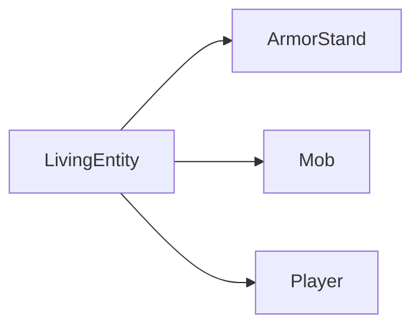
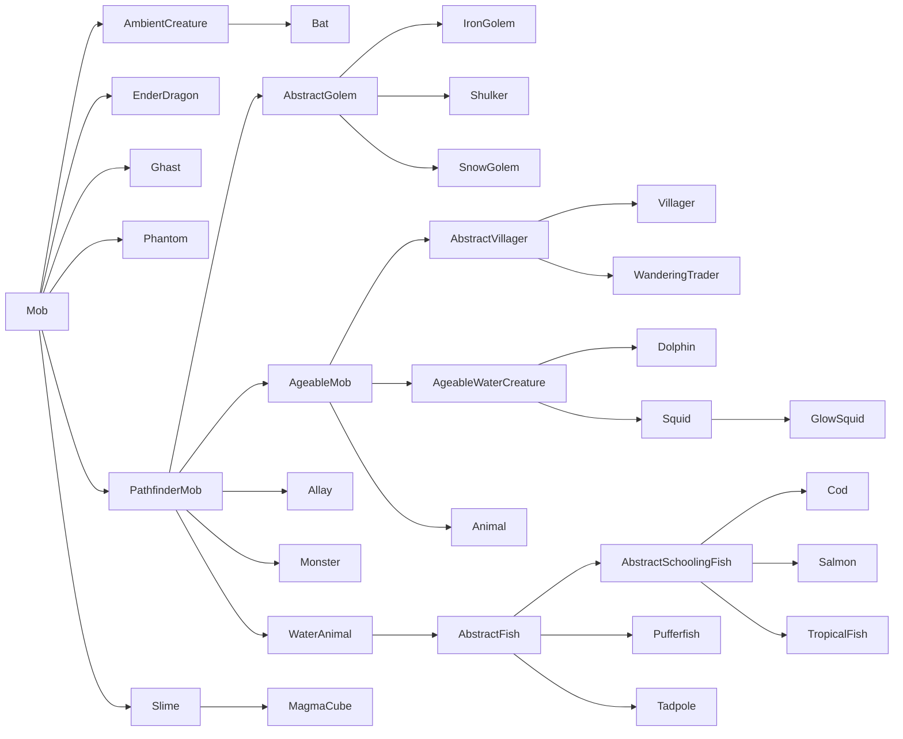
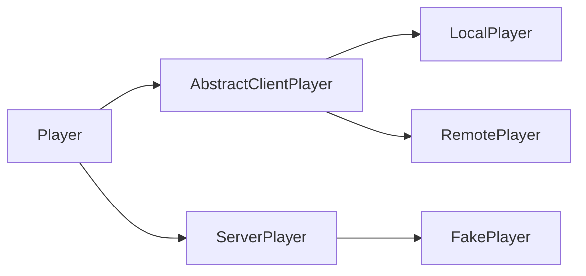

# **活体实体**(`Living Entities`)、**生物**(`Mobs`) 和 **玩家**(`Players`)

**活体实体**(`Living entities`)是[实体][entities]的一个大类，它们都继承自共同的 `LivingEntity` 超类。这些实体包括生物（通过 `Mob` 子类）、玩家（通过 `Player` 子类）和盔甲架（通过 `ArmorStand` 子类）。

活体实体具有许多常规实体没有的附加属性。这些属性包括[属性][attributes]、[状态效果][mobeffects]、伤害追踪等。

## **生命值**(`Health`)、**伤害**(`Damage`) 和 **治疗**(`Healing`)

_另见：[属性][attributes]。_

活体实体与其他实体最显著的区别之一是完善的生命值系统。活体实体通常有最大生命值、当前生命值，有时还有护甲或自然恢复等机制。

默认情况下，最大生命值由 `minecraft:generic.max_health` [属性][attributes]决定，当前生命值在[生成][spawning]时设置为相同值。当实体通过调用 [`Entity#hurtServer`][hurt] 受到伤害时，当前生命值会根据伤害计算减少。许多实体（如僵尸）默认会保持在减少后的生命值，而一些实体（如玩家）可以恢复这些损失的生命值。

获取或设置最大生命值需要直接读取或写入属性，如下所示：

```java
// 获取实体的属性映射
AttributeMap attributes = entity.getAttributes();

// 获取实体的最大生命值
float maxHealth = attributes.getValue(Attributes.MAX_HEALTH);
// 上述的快捷方式
maxHealth = entity.getMaxHealth();

// 设置最大生命值必须通过获取 AttributeInstance 并调用 #setBaseValue，或者
// 添加属性修饰符。这里我们使用前者。更多细节请参阅属性文章
attributes.getInstance(Attributes.MAX_HEALTH).setBaseValue(50);
```

当[受到伤害][damage]时，活体实体会应用一些额外的计算，例如考虑 `minecraft:generic.armor` 属性（除非[伤害类型][damagetypes]在 `minecraft:bypasses_armor` [标签][tags]中）以及 `minecraft:generic.absorption` 属性。活体实体也可以覆盖 `#onDamageTaken` 来执行攻击后的行为；仅当最终伤害值大于零时才会调用此方法。

### **伤害事件**(`Damage Events`)

由于伤害管道的复杂性，有多个事件可供你挂钩，它们按列出的顺序触发。这通常适用于你想对不属于（或不必然属于）你的实体进行的伤害修改，即如果你想修改对 Minecraft 或其他模组实体的伤害，或修改对任何实体的伤害（无论是否属于你）。

所有这些事件的共同点是 `DamageContainer`。一个新的 `DamageContainer` 在攻击开始时实例化，并在攻击结束后丢弃。它包含原始的 [`DamageSource`][damagesources]、原始伤害量以及所有单独修改的列表——护甲、吸收、[附魔][enchantments]、[状态效果][mobeffects]等。`DamageContainer` 传递给下面列出的所有事件，你可以检查已进行的修改，以便根据需要做出自己的更改。

#### `EntityInvulnerabilityCheckEvent`

此事件允许模组同时绕过和为实体添加无敌状态。此事件也会为非活体实体触发。你可以使用此事件使实体免疫攻击，或剥夺其可能存在的现有免疫。

出于技术原因，此事件的钩子应该是确定性的，并且仅依赖于伤害类型。这意味着无敌的随机几率，或仅适用于特定伤害量的无敌，应改为在 `LivingIncomingDamageEvent` 中添加（见下文）。

#### `LivingIncomingDamageEvent`

此事件仅在服务器端调用，应主要用于两个用例：动态取消攻击，以及添加伤害减免修饰符回调。

动态取消攻击基本上是添加非确定性无敌，例如取消伤害的随机几率、取决于一天中的时间或承受伤害量的无敌等。一致的无敌应通过 `EntityInvulnerabilityCheckEvent` 执行（见上文）。

伤害减免修饰符回调允许你修改已执行伤害减免的一部分。例如，它允许你将护甲伤害减免的效果减少50%。然后这也会正确传播到状态效果，后者将使用不同的伤害量等。可以像这样添加伤害减免修饰符回调：

```java
@SubscribeEvent // 在游戏事件总线上
public static void decreaseArmor(LivingIncomingDamageEvent event) {
    // 我们仅将此减少应用于玩家，而保持僵尸等不变
    if (event.getEntity() instanceof Player) {
        // 添加我们的伤害减免修饰符回调
        event.getDamageContainer().addModifier(
            // 要针对的伤害减免类型。可能值参见 DamageContainer.Reduction 枚举
            DamageContainer.Reduction.ARMOR,
            // 要执行的修改。接收伤害容器和基础减免作为输入，
            // 并输出新的减免。输入和输出的减免都是浮点数
            (container, baseReduction) -> baseReduction * 0.5f
        );
    }
}
```

回调按添加顺序应用。这意味着在更高[优先级][priority]的事件处理器中添加的回调将首先运行。

#### `LivingShieldBlockEvent`

此事件可用于完全自定义盾牌格挡。这包括引入额外的盾牌格挡、防止盾牌格挡、修改原版盾牌格挡检查、更改对盾牌或攻击物品的伤害、更改盾牌的视野弧度、允许抛射物但阻挡近战攻击（或反之）、被动阻挡攻击（即不使用盾牌）、仅阻挡一定百分比的伤害等。

请注意，此事件不适用于"类似盾牌"物品范围之外的免疫或攻击取消。

#### `ArmorHurtEvent`

此事件应该相当自解释。它在计算攻击的盔甲伤害时触发，可用于修改对哪个盔甲部位造成多少耐久伤害（如果有的话）。

#### `LivingDamageEvent.Pre`

此事件在伤害即将造成前立即调用。此时 `DamageContainer` 已完全填充，最终伤害量可用，且事件不能再被取消，因为此时攻击被视为成功。

此时，各种修饰符都可用，允许你精细修改伤害量。请注意，此时护甲伤害等已经计算完毕。

#### `LivingDamageEvent.Post`

此事件在伤害已造成、吸收值已减少、战斗追踪器已更新、统计和游戏事件已处理后调用。它不可取消，因为攻击已经发生。此事件通常用于攻击后效果。请注意，即使伤害量为零也会触发此事件，因此如果需要，请相应检查该值。

如果你在自己的实体上调用此事件，应考虑覆盖 `ILivingEntityExtension#onDamageTaken()`。与 `LivingDamageEvent.Post` 不同，此方法仅在伤害大于零时调用。

## **状态效果**(`Mob Effects`)

_参见 [状态效果与药水][mobeffects]。_

## **装备**(`Equipment`)

_参见 [实体上的容器][containers]。_

## **层次结构**(`Hierarchy`)

活体实体具有复杂的类层次结构。如前所述，有三个直接子类（红色类为 `abstract`，蓝色类则不是）：



其中，`ArmorStand` 没有子类（也是唯一的非抽象类），因此我们将重点介绍 `Mob` 和 `Player` 的类层次结构。

### `Mob` 的层次结构

`Mob` 的类层次结构如下（红色类为 `abstract`，蓝色类则不是）：



图中缺少的所有其他活体实体都是 `Animal` 或 `Monster` 的子类。

你可能已经注意到，这非常混乱。例如，为什么蜜蜂、鹦鹉等不是飞行生物？当查看 `Animal` 和 `Monster` 的子类层次结构时，这个问题变得更加严重，这里不详细讨论（如果有兴趣，请使用 IDE 的"显示层次结构"功能查找）。最好承认它，但不必担心。

让我们回顾最重要的类：

- `PathfinderMob`：包含（惊喜！）寻路逻辑。
- `AgeableMob`：包含年龄和幼年实体逻辑。僵尸和其他有幼年变体的怪物不扩展此类，而是 `Monster` 的子类。
- `Animal`：大多数动物扩展的类。有进一步的抽象子类，如 `AbstractHorse` 或 `TamableAnimal`。
- `Monster`：游戏中大多数被视为怪物的实体的抽象类。与 `Animal` 类似，有进一步的抽象子类，如 `AbstractPiglin`、`AbstractSkeleton`、`Raider` 和 `Zombie`。
- `WaterAnimal`：水生动物（如鱼、鱿鱼和海豚）的抽象类。由于寻路方式显著不同，这些动物与其他动物分开。

### `Player` 的层次结构

根据玩家所在的端，使用不同的玩家类。除了 `FakePlayer` 外，你永远不需要自己构造玩家。



- `AbstractClientPlayer`：此类用作两个客户端玩家的基础，两者都用于表示[逻辑客户端][logicalsides]上的玩家。
- `LocalPlayer`：此类用于表示当前运行游戏的玩家。
- `RemotePlayer`：此类用于表示 `LocalPlayer` 在多人游戏中可能遇到的其他玩家。因此，`RemotePlayer` 在单机环境中不存在。
- `ServerPlayer`：此类用于表示[逻辑服务器][logicalsides]上的玩家。
- `FakePlayer`：这是 `ServerPlayer` 的特殊子类，设计用作玩家的模拟，用于需要玩家上下文的非玩家机制。

## **生成**(`Spawning`)

除了[常规生成方式][spawning]——即 `/summon` 命令和通过 `EntityType#spawn` 或 `Level#addFreshEntity` 的代码方式——之外，`Mob` 还可以通过其他方式生成。`ArmorStand` 可以通过常规方式生成，而 `Player` 不应由你自己实例化，除了 `FakePlayer`。

### **生成蛋**(`Spawn Eggs`)

为生物[注册][register]生成蛋很常见（尽管不是必需的）。这是通过 `SpawnEggItem` 类完成的，NeoForge 已对其进行修补以执行一些额外设置，例如注册颜色处理程序并将生成蛋添加到内部 `SpawnEggItem` -> `EntityType` 映射中。

```java
// 假设我们有一个名为 ITEMS 的 DeferredRegister.Items
DeferredItem<SpawnEggItem> MY_ENTITY_SPAWN_EGG = ITEMS.registerItem("my_entity_spawn_egg",
    properties -> new SpawnEggItem(
        // 要生成的实体类型
        MY_ENTITY_TYPE.get(),
        // 传递给 lambda 的属性，包含任何额外设置
        properties
    ));
```

作为像其他物品一样的物品，应将其添加到[创造模式标签页][creative]，并添加[客户端物品][clientitem]、[模型][model]和[翻译][translation]。

### **自然生成**(`Natural Spawning`)

_另见 [实体/`MobCategory`][mobcategory]、[世界生成/生物群系修改器/添加生成][addspawns]、[世界生成/生物群系修改器/添加生成成本][addspawncosts]；以及 [Minecraft Wiki][mcwiki] 上的 [生成周期][spawncycle]。_

自然生成对 `MobCategory#isFriendly()` 为 true 的实体（默认所有非怪物实体）每刻执行一次，对 `MobCategory#isFriendly()` 为 false 的实体（所有怪物）每 400 刻（= 20 秒）执行一次。如果 `MobCategory#isPersistent()` 返回 true（主要是动物），此过程还会在区块生成时发生。

对于每个区块和生物类别，检查是否达到生成上限。更技术性地说，这是检查周围 `loadedChunks` 区域中该 `MobCategory` 的实体是否少于 `MobCategory#getMaxInstancesPerChunk() * loadedChunks / 289`，其中 `loadedChunks` 最多是以当前区块为中心的 17x17 区块区域，如果加载的区块较少（由于渲染距离或类似原因），则区块数更少。

接下来，对于每个区块，要求至少有一个玩家附近（"附近"表示生物与玩家的距离 ≤  128 ）该 `MobCategory` 的实体少于 `MobCategory#getMaxInstancesPerChunk()`，才会发生该 `MobCategory` 的生成。

如果满足条件，则从相关生物群系的生成数据中随机选择一个条目，如果可以找到合适的位置，则发生生成。最多尝试三次寻找随机位置；如果仍然找不到位置，则不会发生生成。

#### **示例**(`Example`)

听起来很复杂？让我们以平原生物群系中的动物为例。

在平原生物群系中，每刻游戏尝试生成来自 `CREATURE` 生物类别的实体，该类别包含以下条目：

```json5
[
    {"type": "minecraft:sheep",   "minCount": 4, "maxCount": 4, "weight": 12},
    {"type": "minecraft:pig",     "minCount": 4, "maxCount": 4, "weight": 10},
    {"type": "minecraft:chicken", "minCount": 4, "maxCount": 4, "weight": 10},
    {"type": "minecraft:cow",     "minCount": 4, "maxCount": 4, "weight": 8 },
    {"type": "minecraft:horse",   "minCount": 2, "maxCount": 6, "weight": 5 },
    {"type": "minecraft:donkey",  "minCount": 1, "maxCount": 3, "weight": 1 }
]
```

由于 `CREATURE` 的生成上限为 10，因此会扫描以每个玩家当前区块为中心的至多 17x17 区块区域，查找其他 `CREATURE` 类型实体。如果找到≤ 10 *  chunkCount / 289 个实体（这基本上意味着在未加载区块附近，生成机会变得更高），则对找到的每个实体与最近玩家的距离进行检查。如果至少有一个实体的距离大于 128，则可能发生生成。

如果所有这些检查都通过，则根据权重从上述列表中选择一个生成条目。假设选择了猪。然后游戏检查区块中的随机位置是否适合生成实体。如果位置合适，则根据生成数据中指定的最小和最大计数生成实体（在我们的例子中正好是 4 头猪）。如果位置不合适，游戏会尝试另外两个不同的位置。如果仍然找不到位置，则取消生成。

[addspawncosts]: ../worldgen/biomemodifier.md#add-spawn-costs
[addspawns]: ../worldgen/biomemodifier.md#add-spawns
[attributes]: attributes.md
[clientitem]: ../resources/client/models/items.md
[containers]: ../blockentities/container.md
[creative]: ../items/index.md#creative-tabs
[damage]: index.md#damaging-entities
[damagesources]: ../resources/server/damagetypes.md#creating-and-using-damage-sources
[damagetypes]: ../resources/server/damagetypes.md
[enchantments]: ../resources/server/enchantments/index.md
[entities]: index.md
[hurt]: index.md#damaging-entities
[logicalsides]: ../concepts/sides.md#the-logical-side
[mcwiki]: https://minecraft.wiki
[mobcategory]: index.md#mobcategory
[mobeffects]: ../items/mobeffects.md
[model]: ../resources/client/models/index.md
[priority]: ../concepts/events.md#priority
[register]: ../concepts/registries.md
[spawncycle]: https://minecraft.wiki/w/Mob_spawning#Spawn_cycle
[spawning]: index.md#spawning-entities
[tags]: ../resources/server/tags.md
[translation]: ../resources/client/i18n.md