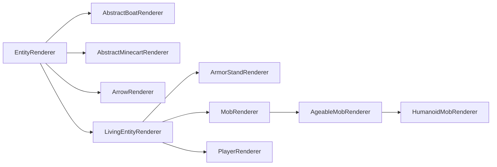

# **实体渲染器**(`Entity Renderers`)

**实体渲染器**(`Entity renderers`)用于定义实体的渲染行为。它们仅存在于[**逻辑客户端和物理客户端**(`logical and physical client`)][sides]。

实体渲染使用被称为**实体渲染状态**(`entity render states`)的机制。简单来说，这是一个保存渲染器所需所有值的对象。每次渲染实体时，渲染状态会被更新，然后`#render`方法使用该渲染状态来渲染实体。这可能是为了将来适配**延迟渲染系统**(`deferred rendering system`)而设计的，即预先收集渲染信息（可能多线程处理），然后在稍后时间点进行渲染。

## 创建实体渲染器

最简单的实体渲染器是直接继承`EntityRenderer`：

```java
// 超类中的泛型类型应设置为要渲染的实体类型。
// 若想为任何实体启用渲染，则使用Entity（如此处所示）。
// 还需使用适合的EntityRenderState，下文详述。
public class MyEntityRenderer extends EntityRenderer<Entity, EntityRenderState> {
    // 构造函数中直接调用super
    public MyEntityRenderer(EntityRendererProvider.Context context) {
        super(context);
    }

    // 告知渲染引擎如何创建新的实体渲染状态
    @Override
    public EntityRenderState createRenderState() {
        return new EntityRenderState();
    }

    // 通过从传入实体复制所需值到传入状态来更新渲染状态
    // Entity和EntityRenderState均可替换为更具体的类型，
    // 具体取决于传递给超类的泛型类型
    @Override
    public void extractRenderState(Entity entity, EntityRenderState state, float partialTick) {
        super.extractRenderState(entity, state, partialTick);
        // 在此处提取并存储状态中的任何附加值
    }
    
    // 实际渲染实体。第一个参数匹配渲染状态的泛型类型。
    // 调用super将为您处理牵引绳和名称标签的渲染（若适用）
    @Override
    public void render(EntityRenderState state, PoseStack poseStack, MultiBufferSource bufferSource, int packedLight) {
        super.render(state, poseStack, bufferSource, packedLight);
        // 在此处执行自定义渲染
    }
}
```

创建完实体渲染器后，还需注册它并连接到所属实体。这需在[`EntityRenderersEvent.RegisterRenderers`][events]中完成：

```java
@SubscribeEvent // 仅在物理客户端的模组事件总线
public static void registerEntityRenderers(EntityRenderersEvent.RegisterRenderers event) {
    event.registerEntityRenderer(MY_ENTITY_TYPE.get(), MyEntityRenderer::new);
}
```

## **实体渲染状态**(`Entity Render States`)

如前所述，实体渲染状态用于将渲染所需的值与实际实体的值分离。它们本质上只是可变的数据存储对象，因此扩展非常简单：

```java
public class MyEntityRenderState extends EntityRenderState {
    public ItemStack stackInHand; // 手持物品
}
```

仅此而已。扩展类，添加字段，在`EntityRenderer`中将泛型类型改为你的类即可。现在唯一剩下的是在`EntityRenderer#extractRenderState`中更新`stackInHand`字段，如上所述。

### 渲染状态修改

除了定义新的实体渲染状态外，NeoForge 还引入了允许修改现有渲染状态的系统。

为此，可创建`ContextKey<T>`（`T`是要修改的数据类型）并存储在静态字段中。然后在`RegisterRenderStateModifiersEvent`的事件处理器中使用它：

```java
public static final ContextKey<String> EXAMPLE_CONTEXT = new ContextKey<>(
    // 上下文键的ID。用于内部区分键
    ResourceLocation.fromNamespaceAndPath("examplemod", "example_context"));

@SubscribeEvent // 仅在物理客户端的模组事件总线
public static void registerRenderStateModifiers(RegisterRenderStateModifiersEvent event) {
    event.registerEntityModifier(
        // 渲染器的TypeToken。由于泛型问题，必须实例化为匿名类（即末尾加{}）并显式指定泛型参数
        new TypeToken<LivingEntityRenderer<LivingEntity, LivingEntityRenderState, ?>>(){},
        // 修改器本身。这是实体和实体渲染状态的BiConsumer
        // 具体泛型类型从渲染器类的泛型推断
        (entity, state) -> state.setRenderData(EXAMPLE_CONTEXT, "Hello World!");
    );
    
    // 上述方法的重载，接受Class<?>
    // 应仅用于没有泛型的渲染器，如PlayerRenderer
    event.registerEntityModifier(
        PlayerRenderer.class,
        (entity, state) -> state.setRenderData(EXAMPLE_CONTEXT, "Hello World!");
    );
}
```

:::tip
通过向`EntityRenderState#setRenderData`传递`null`作为第二个参数可清除值。例如：

```java
state.setRenderData(EXAMPLE_CONTEXT, null);
```
:::

然后在需要处通过`EntityRenderState#getRenderData`检索此数据。辅助方法`#getRenderDataOrThrow`和`#getRenderDataOrDefault`同样可用。

## 层级结构

与实体本身类似，实体渲染器也有类层级结构，但不如实体层级复杂。层级结构中最重要的类关系如下（红色类为`abstract`，蓝色类不是）：



- `EntityRenderer`：抽象基类。许多渲染器（尤其是几乎所有非生物实体的渲染器）直接扩展此类。
- `ArrowRenderer`、`AbstractBoatRenderer`、`AbstractMinecartRenderer`：主要为方便而存在，用作更具体渲染器的父类。
- `LivingEntityRenderer`：[**生物实体**(`living entities`)][livingentity]渲染器的抽象基类。直接子类包括`ArmorStandRenderer`和`PlayerRenderer`。
- `ArmorStandRenderer`：自解释。
- `PlayerRenderer`：用于渲染玩家。注意与大多数渲染器不同，同一时间可能存在多个此类的实例用于不同上下文。
- `MobRenderer`：`Mob`渲染器的抽象基类。许多渲染器直接扩展此类。
- `AgeableMobRenderer`：具有幼年变体的`Mob`渲染器的抽象基类。包括有幼年变体的怪物（如疣猪兽）。
- `HumanoidMobRenderer`：人形实体渲染器的抽象基类。被僵尸、骷髅等使用。

与各种实体类一样，请使用最符合需求的类。注意这些类在泛型中有对应的类型约束；例如，`LivingEntityRenderer`对`LivingEntity`和`LivingEntityRenderState`有类型约束。

## **实体模型**(`Entity Models`)、**层级定义**(`Layer Definitions`)和**渲染层**(`Render Layers`)

更复杂的实体渲染器（尤其是`LivingEntityRenderer`）使用**层级系统**(`layer system`)，每层由`RenderLayer`表示。渲染器可使用多个`RenderLayer`，并可决定何时渲染哪些层。例如，鞘翅使用独立于穿戴`LivingEntity`渲染的单独层。类似地，玩家披风也是独立层。

`RenderLayer`定义了`#render`方法（顾名思义）用于渲染该层。与其他渲染方法类似，可在此渲染任意内容。但非常常见的用例是渲染单独的模型（如盔甲等装备）。

为此，首先需要可渲染的模型。使用`EntityModel`类实现。`EntityModel`本质上是供渲染器使用的立方体和关联纹理的列表。通常在实体渲染器构造函数首次创建时静态创建。

:::note
由于现在操作的是`LivingEntityRenderer`，以下代码将假设`MyEntity extends LivingEntity`且`MyEntityRenderState extends LivingEntityRenderState`以匹配泛型约束。
:::

### 创建实体模型类和层级定义

首先创建实体模型类：

```java
public class MyEntityModel extends EntityModel<MyEntityRenderState> {}
```

注意上例直接扩展`EntityModel`；根据需求，使用子类可能更合适。创建新模型时，建议参考最接近需求的现有模型。

接下来创建`LayerDefinition`。`LayerDefinition`是可烘焙到`EntityModel`的立方体列表。定义`LayerDefinition`如下：

```java
public class MyEntityModel extends EntityModel<MyEntityRenderState> {
    // 创建层级定义的静态方法。createBodyLayer()是
    // 大多数原版模型使用的名称。若有多层，需多个此类静态方法
    public static LayerDefinition createBodyLayer() {
        // 创建网格
        MeshDefinition mesh = new MeshDefinition();
        // 网格初始仅包含根（不可见，尺寸0x0x0）
        PartDefinition root = mesh.getRoot();
        // 添加头部部件
        PartDefinition head = root.addOrReplaceChild(
            // 部件名称
            "head",
            // 要添加的CubeListBuilder
            CubeListBuilder.create()
                // 纹理内使用的UV坐标。纹理绑定见下文
                // 本例从U=10, V=20开始
                .texOffs(10, 20)
                // 添加立方体。可多次调用添加多个立方体
                // 相对于父部件。根部件则相对于实体位置
                // 注意y轴翻转，即"上"为减，"下"为加
                .addBox(
                    // 立方体左上后角，相对于父对象位置
                    -5, -5, -5,
                    // 立方体尺寸
                    10, 10, 10
                )
                // 再次调用texOffs和addBox添加另一个立方体
                .texOffs(30, 40)
                .addBox(-1, -1, -1, 1, 1, 1)
                // addBox()有多种重载，支持额外操作
                // 如纹理镜像、纹理缩放、指定渲染方向
                // 以及全局缩放（称为CubeDeformation）
                // 本例使用后者，更多示例请检查各方法用法
                .texOffs(50, 60)
                .addBox(5, 5, 5, 4, 4, 4, CubeDeformation.extend(1.2f)),
            // 应用于CubeListBuilder所有元素的初始定位
            // 除PartPose#offset外，也可用PartPose#offsetAndRotation
            // 可在多个PartDefinition间复用
            // 并非所有模型都使用。例如自定义盔甲层会使用关联的
            // 玩家（或其他类人生物）渲染器的PartPose使盔甲"贴合"玩家模型
            PartPose.offset(0, 8, 0)
        );
        // 可为任意PartDefinition添加子部件以创建层次结构
        PartDefinition part1 = root.addOrReplaceChild(...);
        PartDefinition part2 = head.addOrReplaceChild(...);
        PartDefinition part3 = part1.addOrReplaceChild(...);
        // 最后从MeshDefinition创建LayerDefinition
        // 两个整数是纹理的预期尺寸；本例为64x32
        return LayerDefinition.create(mesh, 64, 32);
    }
}
```

:::tip
[**Blockbench**][blockbench]建模软件是创建实体模型的绝佳工具。为此，在Blockbench中创建模型时选择Modded Entity选项。

Blockbench还可将模型导出为`LayerDefinition`创建方法（路径：`File -> Export -> Export Java Entity`）。
:::

### 注册层级定义

有了实体层级定义后，需在`EntityRenderersEvent.RegisterLayerDefinitions`中注册。为此需要`ModelLayerLocation`（本质上是层的标识符，注意一个实体可有多个层）。

```java
// 我们的ModelLayerLocation
public static final ModelLayerLocation MY_LAYER = new ModelLayerLocation(
    // 应为该层所属实体的名称
    // 若该层可用于多个实体，可更通用
    ResourceLocation.fromNamespaceAndPath("examplemod", "example_entity"),
    // 层本身的名称。实体基础模型应为main
    // 更具体的层（如"wings"）使用更具描述性的名称
    "main"
);

@SubscribeEvent // 仅在物理客户端的模组事件总线
public static void registerLayerDefinitions(EntityRenderersEvent.RegisterLayerDefinitions event) {
    // 在此处添加层
    event.add(MY_LAYER, MyEntityModel::createBodyLayer);
}
```

### 创建渲染层并烘焙层级定义

下一步是烘焙层级定义，为此先回到实体模型类：

```java
public class MyEntityModel extends EntityModel<MyEntityRenderState> {
    // 存储特定模型部件供下文使用
    private final ModelPart head;
    
    // 传入的ModelPart是烘焙模型的根
    // 下文将说明烘焙过程
    public MyEntityModel(ModelPart root) {
        // super构造函数可指定RenderType
        super(root);
        // 存储头部部件供下文使用
        this.head = root.getChild("head");
    }

    public static LayerDefinition createBodyLayer() {...}

    // 使用此方法根据渲染状态更新模型旋转、可见性等
    @Override
    public void setupAnim(MyEntityRenderState state) {
        // 调用super将所有值重置为默认
        super.setupAnim(state);
        // 更改模型部件
        head.visible = state.myBoolean();
        head.xRot = state.myXRotation();
        head.yRot = state.myYRotation();
        head.zRot = state.myZRotation();
    }
}
```

现在模型能正确接收烘焙的`ModelPart`，可创建`RenderLayer`子类并用于烘焙`LayerDefinition`：

```java
// 泛型参数需匹配之前使用的类型
public class MyRenderLayer extends RenderLayer<MyEntityRenderState, MyEntityModel> {
    private final MyEntityModel model;
    
    // 创建渲染层。渲染器参数需传递给super
    // 可按需添加其他参数。例如需要EntityModelSet进行模型烘焙
    public MyRenderLayer(MyEntityRenderer renderer, EntityModelSet entityModelSet) {
        super(renderer);
        // 使用注册层级定义时的ModelLayerLocation烘焙并存储层级定义
        // 若适用，也可存储多个模型并在下文使用
        this.model = new MyEntityModel(entityModelSet.bakeLayer(MY_LAYER));
    }

    @Override
    public void render(PoseStack poseStack, MultiBufferSource bufferSource, int packedLight, MyEntityRenderState renderState, float yRot, float xRot) {
        // 在此处渲染层。实体模型已存储在字段中，可能需要使用
    }
}
```

### 向实体渲染器添加渲染层

最后，将层添加到渲染器（现在需为生物渲染器）：

```java
// 插入自定义渲染状态类作为泛型类型
// 还需实现RenderLayerParent。某些现有渲染器（如LivingEntityRenderer）已实现
public class MyEntityRenderer extends LivingEntityRenderer<MyEntity, MyEntityRenderState, MyEntityModel> {
    public MyEntityRenderer(EntityRendererProvider.Context context) {
        // LivingEntityRenderer的super构造函数需提供"基础"模型和阴影半径
        super(context, new MyEntityModel(context.bakeLayer(MY_LAYER)), 0.5f);
        // 添加层。从context获取EntityModelSet
        // 示例中忽略渲染层渲染"基础"模型（实际应为不同模型）
        this.addLayer(new MyRenderLayer(this, context.getModelSet()));
    }

    @Override
    public MyEntityRenderState createRenderState() {
        return new MyEntityRenderState();
    }

    @Override
    public void extractRenderState(MyEntity entity, MyEntityRenderState state, float partialTick) {
        super.extractRenderState(entity, state, partialTick);
        // 在此处提取自定义内容，见文章开头
    }

    @Override
    public void render(MyEntityRenderState state, PoseStack poseStack, MultiBufferSource bufferSource, int packedLight) {
        // 调用super会自动渲染层
        super.render(state, poseStack, bufferSource, packedLight);
        // 然后执行自定义渲染（若适用）
    }

    // getTextureLocation是LivingEntityRenderer需重写的抽象方法
    // 纹理路径相对于textures/entity，本例中纹理应位于
    // assets/examplemod/textures/entity/example_entity.png
    @Override
    public ResourceLocation getTextureLocation(MyEntityRenderState state) {
        return ResourceLocation.fromNamespaceAndPath("examplemod", "example_entity");
    }
}
```

### 完整示例

内容太多？由于此系统较复杂，以下再次列出所有组件（几乎无冗余）：

```java
public class MyEntity extends LivingEntity {...}
```

```java
public class MyEntityRenderState extends LivingEntityRenderState {...}
```

```java
public class MyEntityModel extends EntityModel<MyEntityRenderState> {
    public static final ModelLayerLocation MY_LAYER = new ModelLayerLocation(
            ResourceLocation.fromNamespaceAndPath("examplemod", "example_entity"),
            "main"
    );
    private final ModelPart head;
    
    public MyEntityModel(ModelPart root) {
        super(root);
        this.head = root.getChild("head");
        // ...
    }

    public static LayerDefinition createBodyLayer() {
        MeshDefinition mesh = new MeshDefinition();
        PartDefinition root = mesh.getRoot();
        PartDefinition head = root.addOrReplaceChild(
            "head",
            CubeListBuilder.create().texOffs(10, 20).addBox(-5, -5, -5, 10, 10, 10),
            PartPose.offset(0, 8, 0)
        );
        // ...
        return LayerDefinition.create(mesh, 64, 32);
    }

    @Override
    public void setupAnim(MyEntityRenderState state) {
        super.setupAnim(state);
        // ...
    }
}
```

```java
public class MyRenderLayer extends RenderLayer<MyEntityRenderState, MyEntityModel> {
    private final MyEntityModel model;
    
    public MyRenderLayer(MyEntityRenderer renderer, EntityModelSet entityModelSet) {
        super(renderer);
        this.model = new MyEntityModel(entityModelSet.bakeLayer(MyEntityModel.MY_LAYER));
    }

    @Override
    public void render(PoseStack poseStack, MultiBufferSource bufferSource, int packedLight, MyEntityRenderState renderState, float yRot, float xRot) {
        // ...
    }
}
```

```java
public class MyEntityRenderer extends LivingEntityRenderer<MyEntity, MyEntityRenderState, MyEntityModel> {
    public MyEntityRenderer(EntityRendererProvider.Context context) {
        super(context, new MyEntityModel(context.bakeLayer(MY_LAYER)), 0.5f);
        this.addLayer(new MyRenderLayer(this, context.getModelSet()));
    }

    @Override
    public MyEntityRenderState createRenderState() {
        return new MyEntityRenderState();
    }

    @Override
    public void extractRenderState(MyEntity entity, MyEntityRenderState state, float partialTick) {
        super.extractRenderState(entity, state, partialTick);
        // ...
    }

    @Override
    public void render(MyEntityRenderState state, PoseStack poseStack, MultiBufferSource bufferSource, int packedLight) {
        super.render(state, poseStack, bufferSource, packedLight);
        // ...
    }

    @Override
    public ResourceLocation getTextureLocation(MyEntityRenderState state) {
        return ResourceLocation.fromNamespaceAndPath("examplemod", "example_entity");
    }
}
```

```java
@SubscribeEvent // 仅在物理客户端的模组事件总线
public static void registerLayerDefinitions(EntityRenderersEvent.RegisterLayerDefinitions event) {
    event.add(MyEntityModel.MY_LAYER, MyEntityModel::createBodyLayer);
}

@SubscribeEvent // 仅在物理客户端的模组事件总线
public static void registerEntityRenderers(EntityRenderersEvent.RegisterRenderers event) {
    event.registerEntityRenderer(MY_ENTITY_TYPE.get(), MyEntityRenderer::new);
}
```

## 修改现有实体渲染器

某些情况下需要修改现有实体渲染器（如在现有实体上渲染额外效果）。这通常影响生物实体（即使用`LivingEntityRenderer`的实体）。这使我们能向实体添加[**渲染层**(`render layers`)][renderlayer]：

```java
@SubscribeEvent // 仅在物理客户端的模组事件总线
public static void addLayers(EntityRenderersEvent.AddLayers event) {
    // 向每个实体类型添加层
    for (EntityType<?> entityType : event.getEntityTypes()) {
        // 获取渲染器
        EntityRenderer<?, ?> renderer = event.getRenderer(entityType);
        // 检查渲染器是否支持渲染层
        // 若需要通用渲染层，需使用通配符泛型
        if (renderer instanceof MyEntityRenderer myEntityRenderer) {
            // 向渲染器添加层。如上所述，构造新的MyRenderLayer
            // 可通过事件#getEntityModels获取EntityModelSet
            myEntityRenderer.addLayer(new MyRenderLayer(renderer, event.getEntityModels()));
        }
    }
}
```

对于玩家需特殊处理，因实际可能存在多个玩家渲染器。这些由事件单独管理：

```java
@SubscribeEvent // 仅在物理客户端的模组事件总线
public static void addPlayerLayers(EntityRenderersEvent.AddLayers event) {
    // 遍历所有可能的玩家模型
    for (PlayerSkin.Model skin : event.getSkins()) {
        // 获取关联的PlayerRenderer
        if (event.getSkin(skin) instanceof PlayerRenderer playerRenderer) {
            // 向渲染器添加层。假设渲染层
            // 有正确的泛型支持玩家和玩家渲染器
            playerRenderer.addLayer(new MyRenderLayer(playerRenderer, event.getEntityModels()));
        }
    }
}
```

## **动画**(`Animations`)

Minecraft通过`AnimationDefinition`类为实体模型提供**动画系统**(`animation system`)。NeoForge添加了允许在JSON文件中定义实体动画的系统，类似于[**GeckoLib**][geckolib]等第三方库。

动画定义位于`assets/<命名空间>/neoforge/animations/entity/<路径>.json`（例如[**资源位置**(`resource location`)][rl]`examplemod:example`对应`assets/examplemod/neoforge/animations/entity/example.json`）。动画文件格式如下：

```json5
{
    // 动画时长（秒）
    "length": 1.5,
    // 动画结束后应循环(true)或停止(false)
    // 可选，默认为false
    "loop": true,
    // 要动画化的部件列表及其动画数据
    "animations": [
        {
            // 要动画化的部件名称。必须匹配
            // LayerDefinition中定义的部件名称（见上文）。若有多个匹配项，
            // 将选择深度优先搜索的第一个匹配项
            "bone": "head",
            // 要更改的值。可用目标见下文
            "target": "minecraft:rotation",
            // 部件的关键帧列表
            "keyframes": [
                {
                    // 关键帧时间戳（秒）
                    // 应在0到动画时长之间
                    "timestamp": 0.5,
                    // 关键帧的实际"值"
                    "target": [22.5, 0, 0],
                    // 使用的插值方法。可用方法见下文
                    "interpolation": "minecraft:linear"
                }
            ]
        }
    ]
}
```

:::tip
强烈建议将此系统与[**Blockbench**][blockbench]建模软件结合使用，其提供[**动画转JSON插件**(`animation to JSON plugin`)][bbplugin]。
:::

然后在模型中可这样使用动画：

```java
public class MyEntityModel extends EntityModel<MyEntityRenderState> {
    // 创建并存储动画持有器的引用
    public static final AnimationHolder EXAMPLE_ANIMATION =
            Model.getAnimation(ResourceLocation.fromNamespaceAndPath("examplemod", "example"));

    // 存储烘焙动画的字段
    private final KeyframeAnimation example;

    public MyEntityModel(ModelPart root) {
        // 为模型烘焙动画
        // 传入动画应用到的ModelPart
        // 应覆盖所有引用的骨骼
        this.example = EXAMPLE_ANIMATION.get().bake(root);
    }
    
    // 其他代码
    
    @Override
    public void setupAnim(MyEntityRenderState state) {
        super.setupAnim(state);
        // 其他代码
        
        this.example.apply(
            // 从EntityRenderState获取动画状态
            state.myAnimationState,
            // 实体存在时间（刻）
            state.ageInTicks
        );
        // apply()的专门版本，用于行走动画
        this.example.applyWalk(state.walkAnimationPos, state.walkAnimationSpeed, 1, 1);
        // 仅应用动画第一帧的apply()版本
        this.example.applyStatic();
    }
}
```

### **关键帧目标**(`Keyframe Targets`)

NeoForge 默认提供以下关键帧目标：

- `minecraft:position`：目标值设置为部件的位置值
- `minecraft:rotation`：目标值设置为部件的旋转值
- `minecraft:scale`：目标值设置为部件的缩放值

可通过创建新的`AnimationTarget`并在`RegisterJsonAnimationTypesEvent`中注册来添加自定义值：

```java
@SubscribeEvent // 仅在物理客户端的模组事件总线
public static void registerJsonAnimationTypes(RegisterJsonAnimationTypesEvent event) {
    event.registerTarget(
        // 新目标的名称，用于JSON和其他地方
        ResourceLocation.fromNamespaceAndPath("examplemod", "example"),
        // 要注册的AnimationTarget
        new AnimationTarget(...)
    );
}
```

### **关键帧插值**(`Keyframe Interpolations`)

NeoForge 默认提供以下关键帧插值：

- `minecraft:linear`：线性插值
- `minecraft:catmullrom`：沿[**Catmull-Rom样条**(`Catmull-Rom spline`)][catmullrom]插值

可通过创建新的`AnimationChannel.Interpolation`（函数式接口）并在`RegisterJsonAnimationTypesEvent`中注册来添加自定义插值：

```java
@SubscribeEvent // 仅在物理客户端的模组事件总线
public static void registerJsonAnimationTypes(RegisterJsonAnimationTypesEvent event) {
    event.registerInterpolation(
        // 新插值的名称，用于JSON和其他地方
        ResourceLocation.fromNamespaceAndPath("examplemod", "example"),
        // 要注册的AnimationChannel.Interpolation
        (vector, keyframeDelta, keyframes, currentKeyframe, nextKeyframe, scale) -> {...}
    );
}
```

[bbplugin]: https://www.blockbench.net/plugins/animation_to_json
[blockbench]: https://www.blockbench.net/
[catmullrom]: https://en.wikipedia.org/wiki/Cubic_Hermite_spline#Catmull–Rom_spline
[events]: ../concepts/events.md
[geckolib]: https://github.com/bernie-g/geckolib
[livingentity]: livingentity.md
[renderlayer]: #creating-a-render-layer-and-baking-a-layer-definition
[rl]: ../misc/resourcelocation.md
[sides]: ../concepts/sides.md
